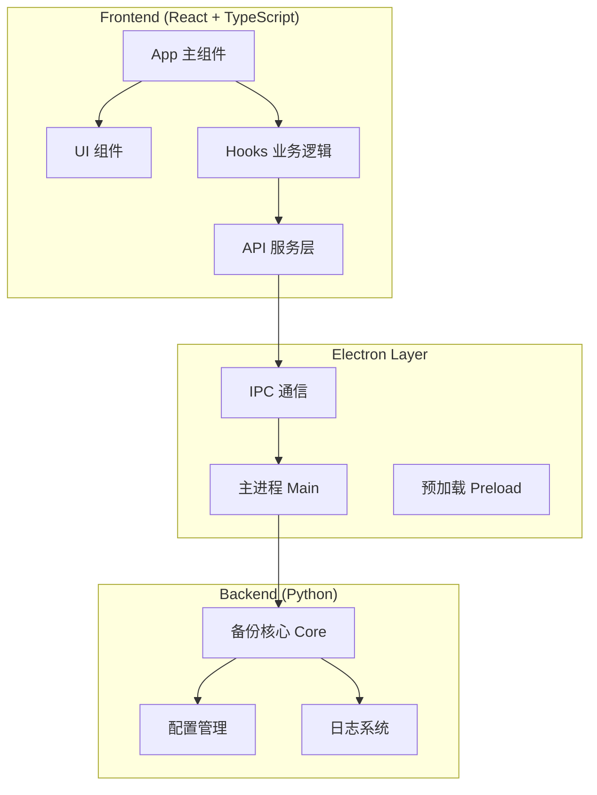
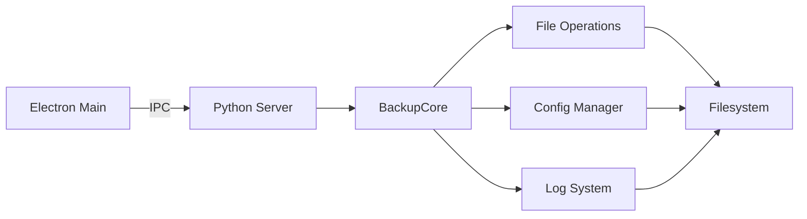
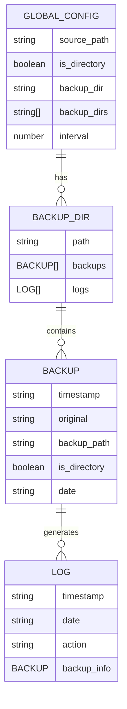

# ASBT 自动存档备份工具 - 技术架构文档

## 1. Architecture Design


## 2. Technology Description
- Frontend: React@18 + TypeScript@5 + tailwindcss@3 + vite@5
- Initialization Tool: vite-init
- UI Framework: tailwindcss + lucide-react
- Desktop: Electron@31 + electron-builder
- Backend: Python 3.8+ (纯本地运行)
- State Management: Zustand
- Build System: Vite

## 3. Route Definitions
| Route | Purpose |
|-------|---------|
| / | 主页面，包含所有功能模块 |

## 4. API Definitions (if backend exists)
```typescript
// 备份信息类型定义
interface BackupInfo {
  timestamp: string;
  original: string;
  backup_path: string;
  is_directory: boolean;
  date: string;
}

// 日志记录类型定义
interface LogEntry {
  timestamp: string;
  date: string;
  action: 'backup' | 'restore' | 'delete' | 'restore_deleted' | 'rollback';
  backup_info: BackupInfo;
}

// 全局配置类型定义
interface GlobalConfig {
  source_path: string;
  is_directory: boolean;
  backup_dir: string;
  backup_dirs: string[];
  interval: number;
}

// API 通信接口
interface BackupAPI {
  getState(): Promise<{
    version: string;
    global_config: GlobalConfig;
    backups: BackupInfo[];
    logs: LogEntry[];
    announcements: { content: string; date: string }[];
  }>;
  
  validateSettings(sourcePath: string, backupDir: string, interval: number): Promise<{
    valid: boolean;
    error?: string;
  }>;
  
  performBackup(): Promise<{
    success: boolean;
    backup_info?: BackupInfo;
    error?: string;
  }>;
  
  restoreBackup(timestamp: string): Promise<{
    success: boolean;
    error?: string;
  }>;
  
  deleteBackup(timestamp: string): Promise<{
    success: boolean;
    error?: string;
  }>;
  
  selectFile(): Promise<string | null>;
  selectDirectory(): Promise<string | null>;
  selectBackupDirectory(): Promise<string | null>;
}
```

## 5. Server Architecture Diagram (if backend exists)


## 6. Data Model (if applicable)

### 6.1 Data Model Definition


### 6.2 Data Definition Language
```json
// 全局配置文件 (autoSaveBackupTool_electron_config.json)
{
  "source_path": "",
  "is_directory": false,
  "backup_dir": "",
  "backup_dirs": [],
  "interval": 5
}

// 备份目录配置文件 (config.json)
{
  "backups": [
    {
      "timestamp": "20240101_120000_123",
      "original": "/path/to/source",
      "backup_path": "/path/to/backup/source_20240101_120000_123",
      "is_directory": false,
      "date": "2024-01-01 12:00:00"
    }
  ],
  "logs": [
    {
      "timestamp": "20240101_120000_123",
      "date": "2024-01-01 12:00:00",
      "action": "backup",
      "backup_info": { ... }
    }
  ]
}
```
