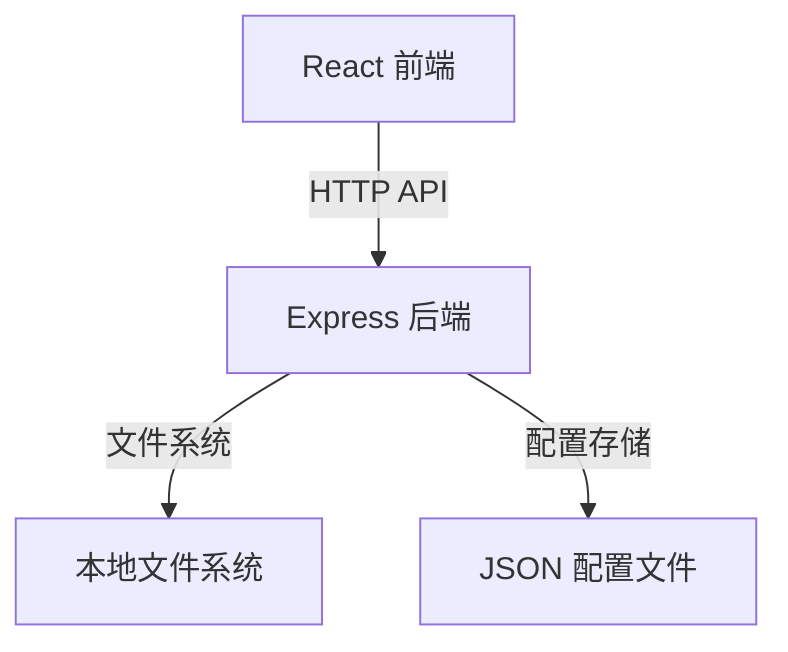
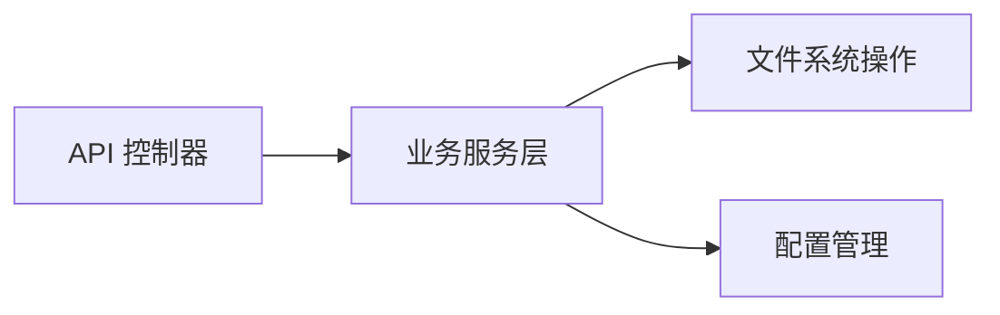

## 1. Architecture Design



## 2. Technology Description
- **前端**: React@18 + TypeScript + Tailwind CSS + Vite
- **初始化工具**: vite-init
- **后端**: Express@4 + TypeScript
- **数据库**: 本地 JSON 文件存储
- **状态管理**: Zustand

## 3. Route Definitions

| Route | Purpose |
|-------|---------|
| / | 主页面 - 文件备份操作界面 |
| /logs | 日志页面 - 查看操作日志 |
| /announcements | 公告页面 - 查看版本公告 |

## 4. API Definitions

### 4.1 文件操作 API

```typescript
// 获取文件列表
interface ListFilesRequest {
  path: string;
}
interface ListFilesResponse {
  files: Array<{name: string, path: string, isDirectory: boolean}>;
}

// 选择源文件/目录
interface SelectSourceRequest {
  path: string;
  isDirectory: boolean;
}
interface SelectSourceResponse {
  success: boolean;
  path: string;
}

// 选择备份目录
interface SelectBackupDirRequest {
  path: string;
}
interface SelectBackupDirResponse {
  success: boolean;
  path: string;
}

// 执行备份
interface PerformBackupRequest {
  sourcePath: string;
  backupDir: string;
  isDirectory: boolean;
}
interface PerformBackupResponse {
  success: boolean;
  backupPath: string;
  timestamp: string;
}

// 获取备份列表
interface GetBackupsRequest {
  backupDir: string;
}
interface GetBackupsResponse {
  backups: Array<{
    timestamp: string;
    original: string;
    backupPath: string;
    isDirectory: boolean;
    date: string;
  }>;
}

// 还原备份
interface RestoreBackupRequest {
  backupPath: string;
  originalPath: string;
  isDirectory: boolean;
}
interface RestoreBackupResponse {
  success: boolean;
}

// 删除备份
interface DeleteBackupRequest {
  backupPath: string;
}
interface DeleteBackupResponse {
  success: boolean;
}
```

### 4.2 日志 API

```typescript
// 获取日志列表
interface GetLogsRequest {
  backupDir: string;
}
interface GetLogsResponse {
  logs: Array<{
    timestamp: string;
    action: string;
    backupInfo: any;
    date: string;
  }>;
}

// 添加日志
interface AddLogRequest {
  backupDir: string;
  action: string;
  backupInfo: any;
}
interface AddLogResponse {
  success: boolean;
}
```

### 4.3 配置 API

```typescript
// 获取配置
interface GetConfigResponse {
  sourcePath: string;
  isDirectory: boolean;
  backupDir: string;
  backupDirs: string[];
  interval: number;
}

// 保存配置
interface SaveConfigRequest {
  sourcePath: string;
  isDirectory: boolean;
  backupDir: string;
  backupDirs: string[];
  interval: number;
}
interface SaveConfigResponse {
  success: boolean;
}
```

## 5. Server Architecture Diagram



## 6. Data Model

### 6.1 配置文件结构

```json
{
  "sourcePath": "",
  "isDirectory": false,
  "backupDir": "",
  "backupDirs": [],
  "interval": 5
}
```

### 6.2 备份配置文件结构

```json
{
  "backups": [
    {
      "timestamp": "20250520_143022_123",
      "original": "/path/to/source",
      "backupPath": "/path/to/backup/source_20250520_143022_123",
      "isDirectory": false,
      "date": "2025-05-20 14:30:22"
    }
  ],
  "logs": [
    {
      "timestamp": "20250520_143022_123",
      "action": "backup",
      "backupInfo": {},
      "date": "2025-05-20 14:30:22"
    }
  ]
}
```

