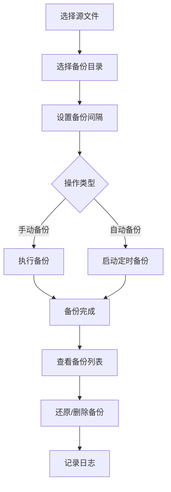

## 1. Product Overview

AutoSaveBackupTool (ASBT) Web 版本是一款基于 Web 的文件存档备份工具，用于自动备份游戏存档或其他重要文件，支持定时和手动备份，便于在文件损坏或丢失时进行恢复。

- 主要目的：提供跨平台、易用的文件备份解决方案
- 目标用户：游戏玩家、需要定期备份文件的个人用户
- 市场价值：将桌面应用的核心功能迁移到 Web，提供更广泛的访问性

## 2. Core Features

### 2.1 User Roles

| Role | Registration Method | Core Permissions |
|------|---------------------|------------------|
| Normal User | Local (无注册) | 使用所有备份功能 |

### 2.2 Feature Module
1. **主界面**: 文件选择、备份设置、备份列表
2. **公告页面**: 版本更新公告展示
3. **日志页面**: 操作日志记录与回溯
4. **历史备份目录**: 备份目录管理

### 2.3 Page Details

| Page Name | Module Name | Feature description |
|-----------|-------------|---------------------|
| 主界面 | 文件选择 | 选择源文件或文件夹 |
| 主界面 | 备份设置 | 设置备份目录和备份间隔 |
| 主界面 | 备份操作 | 手动备份和自动备份控制 |
| 主界面 | 备份列表 | 显示备份历史，支持还原和删除 |
| 公告页面 | 公告展示 | 显示版本更新公告 |
| 日志页面 | 日志管理 | 查看操作日志，支持详情和回溯 |
| 历史备份目录 | 目录管理 | 管理历史备份目录 |

## 3. Core Process

用户在主界面选择源文件/文件夹和备份目录，设置备份间隔，然后可以选择手动备份或启动自动备份。备份完成后可以在备份列表中查看历史记录，进行还原或删除操作。所有操作都会记录在日志中，支持查看详情和回溯。

## 4. User Interface Design

### 4.1 Design Style
- **主色调**: 深蓝 (#1e3a8a) 和青蓝 (#0ea5e9)
- **按钮风格**: 圆角、现代简约、有悬浮效果
- **字体**: Inter 系列，支持中文
- **布局**: 卡片式布局，清晰的模块划分
- **图标**: 使用 Lucide React 图标库

### 4.2 Page Design Overview

| Page Name | Module Name | UI Elements |
|-----------|-------------|-------------|
| 主界面 | 文件选择 | 输入框 + 浏览按钮，卡片样式 |
| 主界面 | 备份列表 | 表格视图，支持右键菜单 |
| 公告页面 | 公告展示 | 滚动文本 + 查看详情按钮 |
| 日志页面 | 日志列表 | 时间线式布局 |

### 4.3 Responsiveness
- 桌面优先，自适应移动设备
- 响应式布局，支持触摸操作

