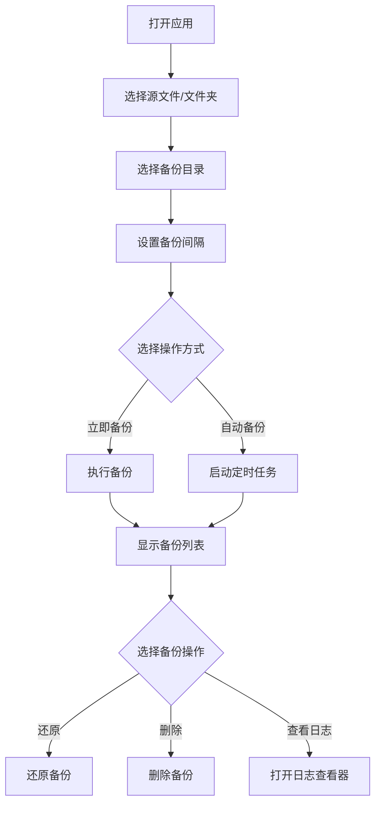

# ASBT 自动存档备份工具 - 产品需求文档

## 1. Product Overview
这是一个基于 Web 技术的本地桌面应用程序，用于自动备份文件和文件夹，提供直观的用户界面和完整的备份管理功能。
- 主要解决用户需要安全备份重要文件的问题，目标用户包括游戏玩家、设计师、开发者等需要定期备份的人群
- 产品价值在于提供简单易用、功能完整的本地备份解决方案，无需联网，完全安全

## 2. Core Features

### 2.1 User Roles (if applicable)
本应用无需多角色设计，单用户模式即可满足需求。

### 2.2 Feature Module
1. **主页面**: 文件选择、备份设置、备份列表、状态栏
2. **公告模块**: 显示最新版本信息和公告
3. **日志查看器**: 查看备份历史操作日志
4. **历史备份目录**: 管理多个备份目录

### 2.3 Page Details
| Page Name | Module Name | Feature description |
|-----------|-------------|---------------------|
| 主页面 | 文件选择区域 | 支持选择单个文件或整个文件夹，显示当前选择的路径 |
| 主页面 | 备份设置区域 | 设置备份目录、备份间隔、立即备份按钮、自动备份开关 |
| 主页面 | 备份列表 | 显示所有备份记录，支持右键菜单操作（还原、删除） |
| 主页面 | 状态栏 | 显示当前状态、版本信息，提供查看日志按钮 |
| 日志查看器 | 日志列表 | 显示所有备份操作历史记录 |
| 公告对话框 | 公告内容 | 显示所有历史公告信息 |

## 3. Core Process
用户打开应用后，首先选择需要备份的源文件或文件夹，然后选择备份存储目录。可以手动立即备份，也可以设置自动备份间隔让应用定时备份。当需要时，用户可以从备份列表中选择某个版本进行还原或删除。所有操作都会记录在日志中供日后查看。

## 4. User Interface Design
### 4.1 Design Style
- 主色调: 深蓝渐变 (#1e3a8a → #3b82f6) 作为主色，绿色 (#10b981) 作为成功/操作色
- 按钮风格: 圆角矩形，带有轻微阴影，悬停时有颜色加深和上移动画
- 字体: 主要使用 Inter 或系统默认无衬线字体，标题 18-20px，正文 14px
- 布局风格: 卡片式布局，各功能模块独立卡片，有明确视觉层次
- 图标风格: 使用 lucide-react 图标库，线性图标，统一 20px 大小

### 4.2 Page Design Overview
| Page Name | Module Name | UI Elements |
|-----------|-------------|-------------|
| 主页面 | 文件选择区域 | 浅蓝色背景卡片，输入框+按钮组合，清晰的图标标识 |
| 主页面 | 备份设置区域 | 白色背景卡片，数字输入框、按钮分组，自动备份状态指示器 |
| 主页面 | 备份列表 | 表格样式，斑马纹行，支持右键菜单，悬停高亮 |
| 主页面 | 状态栏 | 底部固定栏，左中右布局，灰色背景 |

### 4.3 Responsiveness
桌面优先设计，最小窗口尺寸 600x500px，适配各种窗口大小，内容区域自适应调整，支持窗口缩放。

### 4.4 3D Scene Guidance (if applicable)
本项目不涉及 3D 场景。
